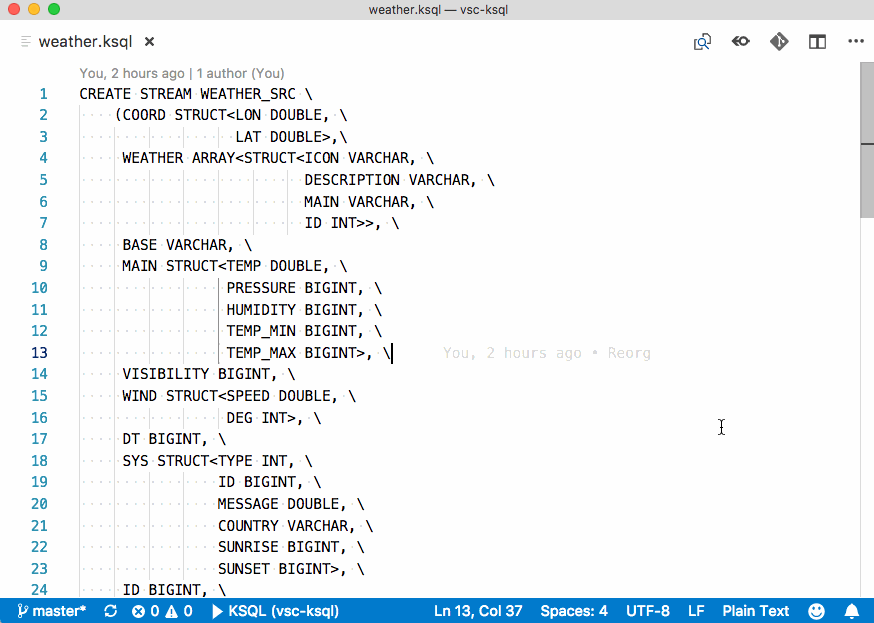

# KSQL VSCode Syntax Highlighting

This provides syntax highlighting for [KSQL - the streaming SQL engine for Apache Kafka](https://www.confluent.io/product/ksql/).

## How to install

From VSCode, go to Extensions (View->Extensions) and search for `KSQL`. Click on `Install` :) 

You can also download the `vsix` file from the [Marketplace](https://marketplace.visualstudio.com/items?itemName=rmoff.ksql) directly to install it locally. 

## How to use it

Any file with the extension `.ksql` will be automagically detected. 

To apply it to any other file, switch the language mode to `KSQL`. You can do this one of two ways: 

1. from the bottom-right of the screen in the status bar, click on the current language name, and change it
2. by going to the command palette (Shift-Cmd-P on the Mac) and entering 'Change Language Mode' (or a subset of it; it will auto-complete), select the match, and then type KSQL. 

The second option is verbose to explain but much faster if you're a keyboard-warrior 😎

## Get up and start developing straight away
* open the terminal in the root of the folder and call `npm install`
* Press `F5` to open a new window with this extension loaded.
* open a file with the .ksql extension in the newly openened window.
* Set breakpoints in the code inside `src/KSQLMain.ts` to debug the extension.
* Find output from the extension in the debug console of the initial window.

## TODO

PRs very welcome!

* Differentiate between keywords, datatypes, etc in formatting
* Add formatting (layout) capabilities
* Syntax checking? 

---- 

[@rmoff](https://twitter.com/rmoff/), August 10 2018
